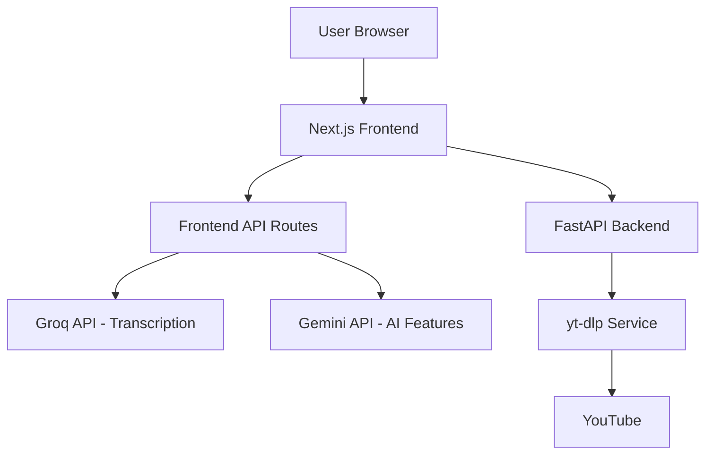

<div align="center">


# 🎓 LearnTube AI

### **AI-Powered Learning Platform**
Transform YouTube videos into comprehensive study materials with cutting-edge AI

[](https://nextjs.org/)
[](https://react.dev/)
[](https://www.typescriptlang.org/)
[](https://fastapi.tiangolo.com/)
[](https://www.python.org/)
[](LICENSE)

[Features](#-features) • [Tech Stack](#-tech-stack) • [Quick Start](#-quick-start) • [Documentation](#-documentation)

</div>

---

## 🌟 Overview

**LearnTube AI** is a modern learning platform that transforms YouTube videos into interactive study materials using advanced AI. Extract transcripts, generate summaries, create flashcards, take quizzes, and chat with an AI tutor - all from a single YouTube link.

> 🚀 **Mission**: Make every YouTube video a comprehensive learning experience

### Key Highlights

- 🎯 **100% YouTube ToS Compliant** - No video downloading, only metadata & captions
- 🤖 **Powered by Leading AI** - Groq Whisper Large V3 + Google Gemini 2.0 Flash
- 🌍 **Multilingual Support** - 25+ languages for transcription & translation
- ⚡ **Lightning Fast** - 10x faster than real-time transcription
- 🎨 **Premium UI/UX** - Modern, responsive design with dark mode
- 🔒 **Privacy First** - Your data stays private and secure

---

## ✨ Features

<table>
<tr>
<td width="50%">

### 🎙️ **AI Transcription**
- Groq Whisper Large V3 Turbo
- 99%+ accuracy across languages
- Interactive, searchable transcripts
- Timestamped segments
- Speaker detection

</td>
<td width="50%">

### 📝 **Smart Summaries**
- Key takeaways & bullet points
- Chapter-by-chapter breakdown
- TL;DR for quick review
- Context-aware analysis
- Gemini 2.0 Flash powered

</td>
</tr>
<tr>
<td width="50%">

### 🃏 **Flashcards**
- Auto-generated decks
- Spaced repetition ready
- Export to Anki/CSV
- Custom categories
- Interactive study mode

</td>
<td width="50%">

### 📊 **Interactive Quizzes**
- Multiple choice questions
- Instant feedback
- Difficulty levels
- Progress tracking
- Comprehensive explanations

</td>
</tr>
<tr>
<td width="50%">

### 💬 **AI Tutor Chat**
- Ask questions about content
- Get detailed explanations
- Interactive Q&A
- Context-aware responses
- Clarify complex topics

</td>
<td width="50%">

### 🌐 **Translation**
- 25+ languages supported
- Context-aware translation
- Preserves technical terms
- Professional quality
- Real-time translation

</td>
</tr>
</table>

---

## 🛠️ Tech Stack

### Frontend
- **Framework**: Next.js 16.1 (App Router)
- **Language**: TypeScript 5
- **Styling**: Tailwind CSS 4 + Shadcn/UI
- **State Management**: Zustand
- **Storage**: IndexedDB (idb)
- **AI SDK**: Google Generative AI, Groq SDK

### Backend
- **Framework**: FastAPI (Python 3.12+)
- **Video Processing**: yt-dlp
- **CORS**: Middleware enabled
- **Async**: asyncio, aiohttp
- **Type Safety**: Pydantic schemas

### AI Services
- **Transcription**: Groq API (Whisper Large V3 Turbo)
- **AI Features**: Google Gemini 2.0 Flash
- **Translation**: Gemini 2.0 with context awareness

---

## 📁 Project Structure

```
learntube-ai/
├── frontend/                # Next.js 16 Application
│   ├── app/
│   │   ├── page.tsx        # Landing page
│   │   ├── learn/          # Main learning interface
│   │   └── api/            # API routes (AI endpoints)
│   ├── components/
│   │   ├── learn/          # Learning components
│   │   ├── shared/         # Reusable components
│   │   └── ui/             # Shadcn/UI components
│   ├── lib/
│   │   ├── ai/             # AI integrations
│   │   └── storage/        # IndexedDB storage
│   └── stores/             # Zustand state
│
├── backend/                # FastAPI Backend
│   ├── app/
│   │   ├── api/v1/         # API endpoints
│   │   ├── core/           # Configuration
│   │   ├── schemas/        # Pydantic models
│   │   └── services/       # Business logic
│   └── main.py             # Application entry
│
└── README.md               # This file
```

---

## 🚀 Quick Start

### Prerequisites

- **Node.js** 20+ and npm
- **Python** 3.12+
- **API Keys** (Free):
  - [Groq API](https://console.groq.com/) - For transcription
  - [Google AI Studio](https://makersuite.google.com/app/apikey) - For AI features

### Installation

#### 1️⃣ Clone the Repository

```bash
git clone https://github.com/yourusername/learntube-ai.git
cd learntube-ai
```

#### 2️⃣ Setup Frontend

```bash
cd frontend
npm install

# Create environment file
cp .env.example .env.local

# Add your API keys to .env.local
# NEXT_PUBLIC_API_URL=http://localhost:8002
# GROQ_API_KEY=your_groq_api_key
# GEMINI_API_KEY=your_gemini_api_key

npm run dev
```

**Frontend**: [http://localhost:3000](http://localhost:3000)

#### 3️⃣ Setup Backend

```bash
cd backend

# Create virtual environment
python -m venv venv
venv\Scripts\activate      # Windows
source venv/bin/activate   # macOS/Linux

# Install dependencies
pip install -r requirements.txt

# Create environment file
cp .env.example .env

# Add your API keys to .env

# Run server
uvicorn main:app --reload --port 8002
```

**Backend API**: [http://localhost:8002/docs](http://localhost:8002/docs)

---

## 🔑 Environment Variables

### Frontend (`.env.local`)

```env
# Backend API URL
NEXT_PUBLIC_API_URL=http://localhost:8002

# AI Service Keys (Server-side only)
GROQ_API_KEY=your_groq_api_key_here
GEMINI_API_KEY=your_gemini_api_key_here
```

### Backend (`.env`)

```env
# Application
APP_NAME=LearnTube AI
APP_VERSION=1.0.0

# API Keys
GROQ_API_KEY=your_groq_api_key_here
GEMINI_API_KEY=your_gemini_api_key_here

# Security
SECRET_KEY=your-secret-key-here

# CORS
ALLOWED_ORIGINS=http://localhost:3000,http://localhost:3001
```

> ⚠️ **Security Note**: Never commit `.env` or `.env.local` files to git. API keys should remain server-side only.

---

## 📖 Documentation

### Frontend

- **Framework**: [Next.js Docs](https://nextjs.org/docs)
- **UI Components**: [Shadcn/UI](https://ui.shadcn.com/)
- **Styling**: [Tailwind CSS](https://tailwindcss.com/docs)

### Backend

- **FastAPI**: [Official Docs](https://fastapi.tiangolo.com/)
- **yt-dlp**: [Documentation](https://github.com/yt-dlp/yt-dlp)

### AI Services

- **Groq API**: [Docs](https://console.groq.com/docs)
- **Gemini API**: [Google AI Studio](https://ai.google.dev/)

---

## 🏗️ Development

### Run Development Servers

```bash
# Terminal 1 - Backend
cd backend
venv\Scripts\activate  # or source venv/bin/activate
uvicorn main:app --reload --port 8002

# Terminal 2 - Frontend
cd frontend
npm run dev
```

### Build for Production

```bash
# Frontend
cd frontend
npm run build
npm start

# Backend
cd backend
uvicorn main:app --host 0.0.0.0 --port 8002
```

### Code Quality

```bash
# Frontend linting
cd frontend
npm run lint

# Backend type checking
cd backend
mypy app/
```

---

## 🚢 Deployment

### Frontend (Vercel - Recommended)

1. Push code to GitHub
2. Import project in [Vercel](https://vercel.com)
3. Add environment variables
4. Deploy automatically

### Backend (Railway/Fly.io)

```bash
# Using Docker
docker build -t learntube-backend ./backend
docker run -p 8002:8002 learntube-backend
```

---

## 📊 Architecture



---

## 🎯 Use Cases

- 📚 **Students**: Study from educational videos
- 👨‍🏫 **Teachers**: Create study materials from lectures
- 🌍 **Language Learners**: Translate and transcribe content
- 🎓 **Exam Prep**: Generate practice questions and flashcards
- 🔬 **Researchers**: Extract insights from technical videos
- 💼 **Professionals**: Learn from conference talks and tutorials

---

## 🔒 Legal & Compliance

✅ **YouTube ToS Compliant**
- No video downloading
- Uses official YouTube APIs and metadata only
- Respects content creator rights

✅ **Privacy First**
- No personal data stored without consent
- API keys secured server-side
- GDPR compliant

✅ **Open Source AI**
- Uses openly accessible AI APIs
- Transparent AI usage
- No vendor lock-in

---

## 🤝 Contributing

This is a proprietary project. For collaboration inquiries, please contact the maintainer.

---

## 📄 License

**Proprietary License** - All rights reserved

This software is proprietary and confidential. Unauthorized copying, distribution, or use of this software, via any medium, is strictly prohibited.

---

## 🙏 Acknowledgments

- [Groq](https://groq.com/) - Lightning-fast AI inference
- [Google Gemini](https://ai.google.dev/) - Advanced AI capabilities
- [Vercel](https://vercel.com/) - Next.js deployment platform
- [Shadcn](https://ui.shadcn.com/) - Beautiful UI components
- [yt-dlp](https://github.com/yt-dlp/yt-dlp) - YouTube metadata extraction

---

<div align="center">

**Made with ❤️ for learners worldwide**

[⬆ Back to Top](#-learntube-ai)

</div>
